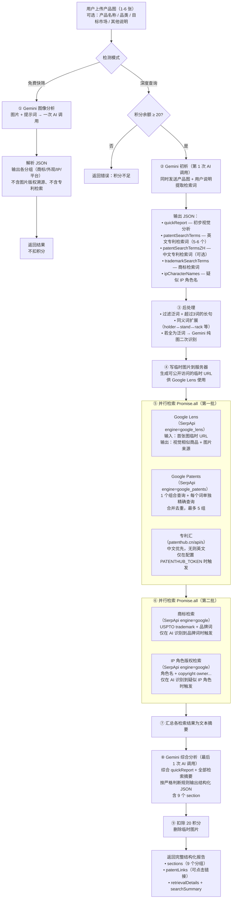

# 侵权风险检测完整说明

> 路由：`/ip-risk`（主导航独立模块）  
> 文件：`src/pages/IpRisk.jsx`，后端接口：`POST /api/ai-assistant/ip-risk-check`

---

## 一、功能概述

侵权风险检测帮助跨境电商卖家在发布产品前，快速评估图片及产品是否存在以下四类知识产权风险：

| 风险类型 | 说明 |
|---------|------|
| **商标 / Logo 侵权** | 产品图中的标志、文字是否侵犯他人注册商标 |
| **外观设计侵权** | 产品外观是否与他人专利外观/设计专利过于相似 |
| **IP 形象 / 版权风险** | 产品是否使用了受版权保护的卡通 IP、角色、图案 |
| **图片版权溯源** | 产品图片本身是否来源于有版权的图库或摄影作品 |

---

## 二、两种检测模式

### 快速筛查（免费）

| 项目 | 说明 |
|------|------|
| 工具 | Google Gemini AI |
| 费用 | **免费，不扣积分** |
| 检测维度 | 商标/Logo 识别、外观设计相似性、IP 角色/图案识别、平台合规风险 |
| 速度 | 约 10～30 秒 |
| 适合场景 | 日常快速初筛，批量产品风险排查 |
| 局限性 | 仅凭 AI 视觉分析，不检索外部数据库，结论为初步判断 |

### 深度查询（20 积分/次）

在快速筛查基础上，额外调用 Google 外部检索服务：

| # | 服务 | 输入 | 判断维度 | 是否必然触发 |
|---|------|------|---------|------------|
| 1 | **Google Lens**（以图搜图 + 来源溯源） | 首张产品图 | 外观设计侵权、图片版权溯源 | 每次都有 |
| 2 | **Google Patents**（专利检索） | AI 提取英文关键词 → 后处理（去泛词、限长、同义词扩展）→ **1 个组合查询 + 每个词单独 `"词" design patent` 精确查询**，去重后最多 **5 次** SerpApi 调用，结果合并去重 | 专利侵权风险（美国专利库） | 每次都有 |
| 3 | **专利汇**（专利检索） | AI 提取中/英文关键词（中文优先查中国专利） | 专利侵权风险（中国+全球专利库） | 已配置 PATENTHUB_TOKEN 时 |
| 4 | **Google 搜索**（商标检索） | AI 提取品牌词 → 查询 USPTO | 商标/Logo 侵权风险 | 图中有可疑品牌词时触发 |
| 5 | **Google 搜索**（IP 角色版权检索） | AI 识别到的 IP 角色/图案名 | IP 形象版权归属方 | 图中疑似 IP 角色时触发 |
| — | **Gemini AI 综合分析** | 全部检索结果 | 汇总生成分组报告（含专利综合风险） | 每次都有 |

**SerpApi 实际调用次数：最少 **3** 次（Lens 1 + Google Patents 至少 2：组合查询 + 逐词精确），最多 **8** 次（Lens 1 + Patents 最多 5 + 商标 1 + IP 角色 1）。** 专利汇为独立 HTTP，不经 SerpApi。

---

## 三、检测结果结构

深度查询返回如下分组报告（`sections` 字段）：

| 字段 | 说明 |
|------|------|
| `trademarkRisk` | 商标 / Logo 风险 |
| `patentRisk` | **专利综合风险**（字符串：综合报告要求按 Markdown 列表行写出美国/专利汇命中与链接；若 AI 误返回嵌套对象，后端 `ensureSectionString` 会转为可读文本；正文内裸 URL 由前端 `linkifyUrls` 转为可点击链接） |
| `designRisk` | 外观设计风险（侧重视觉相似性，与 Lens 匹配结果结合） |
| `ipImageRisk` | IP 形象 / 版权风险 |
| `copyrightSourceRisk` | 图片版权溯源 |
| `platformRisk` | 平台合规风险（亚马逊/速卖通等） |
| `overallLevel` | 综合风险等级（低 / 中 / 高） |
| `suggestions` | 建议 |
| `disclaimer` | 免责声明 |

前端展示中，各分组卡片首行若解析到风险等级为「高」或「中高」，以红色+警告图标标注；每个 section 卡片独立显示。

报告同时包含：
- **本次检索方式汇总**（`searchSummary`）：实际执行的检索服务
- **相关专利文献链接**（`patentLinks`）：数组，每项含 `source`（Google Patents / 专利汇）、`number`、`title`、`url`（可点击打开官方页）；由后端从检索结果去重合并，与文字报告并列展示
- **检索结果明细（按来源）**（`retrievalDetails`）：各查询实际返回结果，便于区分 Google Patents 与专利汇等不同来源（Google Patents 条目含解析出的公开号 `id`）

---

## 四、实现原理与完整流程

### 4.1 入口与流程分支

| 项目 | 说明 |
|------|------|
| 入口 | 路由 `/ip-risk`，页面 `src/pages/IpRisk.jsx` |
| 接口 | `POST /api/ai-assistant/ip-risk-check`（需登录） |
| 模式 | **快速筛查**（免费）/ **深度查询**（20 积分/次） |

用户上传产品图，可选填产品名称、品类、目标市场等，选择模式后发起请求。

---

### 4.2 完整流程图（Mermaid）



> **说明**：正常深度查询 **2 次 AI 调用**（初析 + 综合报告）；泛词兜底时 3 次（按需）。SerpApi 调用 **最少 3 次、最多 8 次**（见 4.5 节）。

---

### 4.3 快速筛查（Quick）详解

**纯 Gemini，不联网检索。**

1. **输入**：多张产品图 + 可选文字说明（产品名称、品类等）
2. **调用**：一次 Gemini API，图片 + 文本 prompt
3. **输出**：解析 JSON，得到各 section（商标、外观、IP、平台、综合等级等）
4. **不含**：图片版权溯源（`copyrightSourceRisk`）、专利检索结果
5. **局限**：仅 AI 视觉推断，不做专利/商标/图库检索

---

### 4.4 深度查询（Deep）— 各阶段详解

#### 阶段 1：Gemini 初析（第 1 次 AI 调用）

**目的**：从图+文提取后续外部检索所需的关键词。

- **输入**：产品图（最多 5 张）+ 用户填写信息
- **输出**：
  - `quickReport`：初步视觉分析（商标/外观/IP/平台）
  - `patentSearchTerms`：英文专利检索词（5-6 个，每个 1-3 单词，覆盖多种命名角度）
  - `patentSearchTermsZH`：中文检索词（可选，用于专利汇中国专利库）
  - `trademarkSearchTerms`：商标检索词（1-3 个英文品牌词）
  - `ipCharacterNames`：疑似 IP 角色名称

#### 阶段 2：检索词后处理（纯代码逻辑，无 AI 调用）

1. **过滤泛词**：剔除 `product design`、`consumer product` 等
2. **过滤长句**：超过 3 个单词的描述性短语不适合专利标题搜索
3. **同义词扩展**（`expandPatentSynonyms`）：基于通用同义词对表自动生成变体。设计专利中 `holder`/`stand`/`rack`、`mount`/`bracket`、`case`/`cover`、`dispenser`/`holder` 等词经常互换。如 AI 生成了 `napkin holder`，系统自动补充 `napkin stand` 和 `napkin rack`。这是通用规则，不针对任何特定产品。
4. **泛词兜底**：若过滤后仍全为泛词，触发第二次轻量 Gemini 调用（纯看图识别品类词）

#### 阶段 3：临时图落地

- 首张图写入临时目录 `.temp-ip-risk/`，生成可访问 URL（Lens 需要）
- 请求完成后自动删除

#### 阶段 4：并行外部检索（第一批）

| 序号 | 服务 | 输入 | 触发条件 |
|------|------|------|----------|
| 1 | Google Lens | 首张图临时 URL | 每次必做 |
| 2 | Google Patents | 检索词（经同义词扩展后） | 每次必做 |
| 3 | 专利汇 | 中文优先、无则英文 | 配置了 `PATENTHUB_TOKEN` |

**Google Patents 多组查询逻辑（`fetchGooglePatentsMulti`）**：

```
查询1：前 3 个词拼接组合查询（宽泛覆盖）
查询2-N：每个词单独做 "词" design patent 精确查询（精确命中）
去重后取前 5 组
```

**核心设计思想**：每个检索词都单独精确查询一次，无论它在词表中的位置。这样即使某个冷门同义词（如同义词扩展补充的 `napkin stand`）排在最后，也会被独立搜索，从而命中以该词命名的专利。

#### 阶段 5：并行外部检索（第二批）

| 服务 | 输入 | 触发条件 |
|------|------|----------|
| Google 搜索（商标） | `USPTO trademark + trademarkSearchTerms[0]` | AI 提取到商标词时 |
| Google 搜索（IP 角色版权） | `角色名 + copyright owner...` | AI 识别到疑似 IP 角色时 |

#### 阶段 6：Gemini 综合报告（最后 1 次 AI 调用）

- **输入（纯文本）**：`quickReport` + Lens摘要 + 专利摘要 + 商标摘要 + IP版权摘要
- **严格判断规则**（写入 prompt）：
  1. Lens 命中大量电商/品牌站同款 → `overallLevel` 不得评为「低」
  2. 专利检索命中同品类外观/设计专利 → 必须在 `patentRisk` 列为需关注项
  3. 专利无命中但 Lens 大量相似商品 → 须说明「关键词检索可能未覆盖」并建议 FTO
- **输出**：结构化 JSON，含 9 个 section（见第三节）

#### 阶段 7：扣费与返回

- 扣 20 积分，删除临时图片
- 返回：`sections`、`patentLinks`、`retrievalDetails`、`searchSummary`

---

### 4.5 SerpApi 实际调用次数

| 情况 | 最少 | 最多 |
|------|------|------|
| Lens | 1 | 1 |
| Google Patents（1 组合 + 逐词 `"词" design patent`，去重后截断） | **2** | **5** |
| 专利汇（可选，1 次 HTTP，不经 SerpApi） | 0 | 1 |
| 商标检索（按需） | 0 | 1 |
| IP 角色版权检索（按需） | 0 | 1 |
| **SerpApi 合计** | **3** | **8** |

> 典型上限（有商标词、有 IP 角色、Patents 打满 5 次）：Lens(1) + Patents(5) + 商标(1) + IP(1) = **8 次**。

---

### 4.6 外部依赖一览

| 依赖 | 用途 | 配置 |
|------|------|------|
| Gemini API | 图像理解 + 文本生成 | `GEMINI_API_KEY` |
| SerpApi | Google Lens、Patents、搜索 | `SERPAPI_KEY`（深度查询必备） |
| 专利汇 | 中国+全球专利 | `PATENTHUB_TOKEN`（可选） |

未配置 `SERPAPI_KEY` 时，深度查询返回「深度查询暂未开放」。

---

## 五、SerpApi 与 Google 的关系

SerpApi 是一个**第三方付费服务**，合法地把 Google Lens / Google Patents / Google 搜索的结果以 API 形式提供给开发者。

> **比喻**：Google 是图书馆，SerpApi 是帮你去图书馆查资料、整理好抄回来的「跑腿服务」。

**为什么不直接用 Google？**

| 问题 | 说明 |
|------|------|
| Google 无免费搜索 API | 官方 Custom Search API 每天仅免费 100 次，且功能有限 |
| Google Lens 无公开 API | 想以图搜图，没有官方接口 |
| Google Patents 无直接 API | 专利搜索同样无公开接口 |
| 直接爬取违反服务条款 | 自写爬虫会被封 IP |

---

## 六、费用构成

### 运营成本

| 项目 | 费用 | 当前状态 |
|------|------|---------|
| SerpApi | Free 免费 | **当前使用免费版**（约 250 次/月） |
| 专利汇 | 免费 | **当前使用免费版** |
| Gemini API | 已有，不另计 | — |
| **合计（当前）** | **¥0** | SerpApi、专利汇均免费 |

**可支撑量**：当前 SerpApi 免费版约 250 次/月，每次深度查询消耗约 **3～8** 次 SerpApi（含 Google Patents 多组查询），粗算约可支撑 **31～83 次深度查询/月**（按 8 次/次与 3 次/次估算）。正式运营可升级 SerpApi Developer（$75/月，5,000 次），按同样区间粗算约可支撑 **625～1,666 次/月**。

### 用户收费

- **快速筛查**：免费
- **深度查询**：20 积分/次（¥200 套餐下 = ¥4.00/次）

---

## 七、功能配置（服务器端）

深度查询依赖 `SERPAPI_KEY` 环境变量。未配置时，深度查询按钮报错「深度查询暂未开放」。

**可选**：配置 `PATENTHUB_TOKEN` 后，专利检索将同时调用专利汇（中国+全球专利库），与 Google Patents（美国为主）互补。**当前使用专利汇免费版**。不配置则仅用 Google Patents。

配置方式见 [DEPLOY.md](./DEPLOY.md) — 第三节。

---

## 八、待开放的检测维度

以下功能技术上可实现，暂未集成，后续可按需开放：

| 功能 | 工具 | 费用 | 说明 |
|------|------|------|------|
| 美国版权局登记查询 | copyright.gov | 免费 | 可查询 1978 年后在美国主动登记的版权作品。注意：版权无需登记即自动产生，未找到记录不代表无保护。 |
| 专业图片版权溯源 | TinEye API | 约 ¥2,200/年（5,000 次） | 专注图片来源追踪，比 Google Lens 更擅长找到图片最早出现页面，适合核查产品图是否来自有版权图库。 |
| WIPO 全球数据库 | WIPO IP Portal | 免费（接口较复杂） | 全球商标、外观设计、版权，覆盖比 USPTO 更广，可补充非美国市场检索。 |
| 专业商标相似度比对 | IPRScan | 约 €249/年 | USPTO + EUIPO，含视觉/语音/概念相似度评分，比 Google 搜索更精准。 |

### 建议分步策略

1. **已完成**：免费快筛（Gemini）+ 深度查询（Google Lens / Google Patents / 专利汇（可选）/ 商标 / IP 角色版权，SerpApi + PatentHub）。
2. **下一步可选**：接入 IPRScan（€249/年），向需要专业商标比对的客户提供更精准的商标报告。
3. **按需开放**：TinEye 专业图片溯源（¥2,200/年）、WIPO 全球数据库、美国版权局查询。

---

## 九、向客户解释时可以说

> 「深度查询会做以下几项检索：① **以图搜图**（Google Lens）——看您的产品在全网和谁长得像，同时追踪图片来源；② **专利检索**（Google Patents + 专利汇）——AI 提取多组关键词，系统再自动补充同义变体（比如 holder→stand→rack），每个词单独在美国专利库精确搜索一遍，专利汇查中国及全球专利库（已配置时），合并去重；③ **商标检索**——以美国商标信息为主，辅助判断 Logo/品牌词侵权风险；④ 若图中检测到疑似 IP 角色/图案，还会自动查该 IP 的版权归属方。最后由 AI 综合出分组报告。报告仅供参考，不构成法律意见，高风险项建议咨询专业知识产权律师。」

---

## 十、漏检分析与已实施改进

### 10.1 根因一：专利检索词过于泛化

针对「三齿烤串架（带滑轨推料）」等案例，根因主要为 AI 返回 `product design`、`consumer product` 等泛词，检索不到具体产品类别的专利。

### 10.2 根因二：美国专利命名与日常叫法差异极大（⚠️ 难以根治）

**已知真实案例**：

| 项目 | 内容 |
|------|------|
| 产品 | 金色纸巾架 |
| 中文日常叫法 | 纸巾架 |
| AI 预期生成词 | paper towel holder, napkin holder, towel stand |
| **专利实际标题** | **Cocktail napkin stand** |
| 专利号 | USD1098777S1 |
| 申请时间 | 2024-04-08 |
| 下证时间 | 2025-10-21 |

**根因分析**：`cocktail`（鸡尾酒）这个词无法从产品图或名称「纸巾架」中预测出来。美国专利申请人可以用任意名称命名外观专利，与产品市场名称完全不同。这是关键词检索的根本局限，任何检索工具（包括人工）都难以 100% 避免。

---

### 10.3 已实施改进汇总

| 改进项 | 说明 |
|--------|------|
| 强化 prompt（泛化词） | 明确禁止泛化词，要求具体品类词+结构特征词 |
| **强化 prompt（命名变体）** | 要求生成 5-6 个词，每个 1-3 单词，须从多种不同角度命名；系统对每个词单独精确查询，词越多角度越不同漏检越少 |
| 双语检索词 | **patentSearchTerms**（英文）用于 Google Patents；**patentSearchTermsZH**（中文，可选）用于专利汇中国专利库 |
| 语言说明 | AI 始终输出英文检索词；专利汇有中文词时优先中文查中国专利 |
| 泛词时 AI 二次识别 | AI 返回泛词时发起第二次轻量调用，纯看图识别品类词 |
| **逐词精确查询** | `fetchGooglePatentsMulti` 对每个检索词单独做 `"词" design patent` 精确查询，最多 5 组，确保每个词（含同义词扩展的变体）都被独立搜索 |
| **通用同义词扩展** | `expandPatentSynonyms` 基于 10 对同义词（holder↔stand↔rack、mount↔bracket、case↔cover 等）自动补充变体词，不针对任何特定产品 |
| 检索词数量 | AI 输出 5-6 个词，同义词扩展后最多 10 个；专利汇用前 4 个词拼接单次查询 |
| 前端引导 | 深度查询模式下，产品名称输入框提示「填写产品名称有助于提高专利检索准确率」 |
| 报告正文清洗 | 去除正文开头的「风险。」「等。」等多余片段 |

**使用建议**：尽量填写「产品名称」和「品类」，有助于提高专利检索命中率。对于高客单价、高备货量的产品，系统报告应作为**初步参考**，建议搭配人工关键词搜索（直接在 [Google Patents](https://patents.google.com) 搜索产品主类词）或咨询知识产权律师做 FTO（Freedom-to-Operate）分析。

**后续可考虑**：CPC 分类号补充（查到专利后，用其 CPC 码反查同类其他专利）、Lens 强相似时增加醒目提示。

### 检索词语言与数据源

| 数据源 | 使用语言 | 说明 |
|--------|----------|------|
| Google Patents（美国专利） | 英文 | AI 始终输出英文 patentSearchTerms，用户填中文或英文均可 |
| 专利汇（中国+全球） | 中文优先、英文兜底 | 有 patentSearchTermsZH 时用中文查中国专利；否则用英文。专利汇 API 支持中英文查询 |

---

## 十一、外部数据源集成可行性（供决策参考）

客户常咨询：能否将美国版权局与专利汇的查询能力集成到 PicToolAI？

### 专利汇（patenthub.cn）— 已集成 ✅

- **结论**：可行，已实现。**当前使用专利汇免费版**。
- 后端深度查询流程已集成专利汇 `/api/s` 接口；环境变量 `PATENTHUB_TOKEN`（不配置则跳过）。
- 与 Google Patents 并行调用，结果合并；报告显示「Google Patents + 专利汇」。
- 覆盖中国+全球专利库；免费 TOKEN 申请：[patenthub.cn/api/open](https://www.patenthub.cn/api/open)。

### 美国版权局（copyright.gov）— 难度较大 ⚠️

- **结论**：不提供实时 API，自建检索需下载并索引数十 GB 级批量数据，开发与运维成本高。
- **替代**：在侵权检测页面增加「美国版权局官网」入口，引导用户手动查询。

### 综合建议

| 方案 | 可行性 | 建议 |
|------|--------|------|
| 专利汇 | ✅ 已实现（当前免费版） | 有中国/全球专利需求时配置 PATENTHUB_TOKEN |
| 版权局检索 | ⚠️ 复杂 | 可先提供官网跳转，自建待评估 |

---

## 十二、重要免责说明

- 本工具的检测结果**仅供参考**，不构成法律意见。
- 侵权判定是复杂的法律问题，涉及地域、使用方式、相似程度等多重因素。
- 对于「高」风险结论，强烈建议咨询专业知识产权律师后再做决策。
- 快速筛查仅基于 AI 视觉分析，深度查询也有一定漏判率，不能保证 100% 准确。
- **深度查询中的专利检索为关键词驱动的公开库检索**，受 AI 提取词、专利标题命名习惯、索引与排序等限制，**无法替代律师或检索机构做的 FTO（自由实施）分析**；对高备货、高客单价产品仍建议人工在 [Google Patents](https://patents.google.com) 等渠道补充检索。
